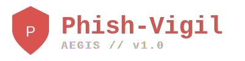

# Phish-Vigil v5.0 "Aegis"
### Enterprise Human Risk Intelligence Platform

**Phish-Vigil Aegis** is a defensive, audit-grade security platform designed to measure, model, and improve human security behavior. Unlike traditional tools that only count "clicks," Aegis calculates **Risk Velocity**, **Resilience**, and **Learning Momentum**.

---

## 👤 Author & Maintainer
* **Name:** Syed Sameer Ul Hassan
* **Certification:** Certified Cybersecurity Technician (CCT) - EC-Council
* **Website:** [sameer.orildo.online](https://sameer.orildo.online)
* **GitHub:** [syed-sameer-ul-hassan](https://github.com/syed-sameer-ul-hassan)
* **Email:** sameer@orildo.online

---

## 🛡️ Key Features

### 1. Dual-Score Engine
* **Risk Score (0-100):** Measures liability. Increases with unsafe actions, decays naturally over time.
* **Resilience Score (0-100):** Measures asset strength. Increases when users report threats or maintain safety streaks.

### 2. Risk Velocity Tracking
* Tracks the *speed* of risk change.
* Answers the executive question: *"Are we getting safer than we were last month?"*

### 3. Compliance-Ready Audit
* **WORM Logging:** Write-Once, Read-Many architecture for logs.
* **Integrity Hashing:** Every action is SHA-256 hashed to prevent tampering.
* **Role-Based Access Control (RBAC):** Strict separation for CISO, Analyst, and Auditor roles.

### 4. Positive Reinforcement
* Users are rewarded for reporting phishing simulations.
* Builds a culture of defense rather than fear.

---

## 🚀 Use Cases
* **Corporate Security Training:** Run safe, authorized phishing simulations.
* **Human Risk Analytics:** Identify high-risk departments without shaming individuals.
* **Compliance Evidence:** Generate ISO 27001 / SOC2 compliant training logs.

---

## 💻 Installation & Usage

### Prerequisites
* Python 3.8+
* \`pip install flask flask-sqlalchemy itsdangerous\`

### Running the Platform
1.  Navigate to the directory:
    \`\`\`bash
    cd ~/Desktop/Phish-Vigil-Aegis
    \`\`\`
2.  Run the server:
    \`\`\`bash
    python phish_vigil_aegis.py
    \`\`\`
3.  Access the Dashboard:
    * API Endpoint: \`http://127.0.0.1:5000/api/v5/dashboard\`

---
